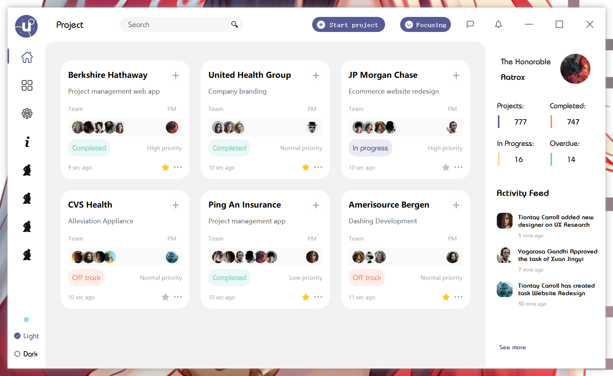

  

<h1 align="center">
  QtAdvancedInterface
</h1>

  Interesting series, Qt(QWidget) advanced interface development.

  
  
  <!---
  
  
  --->

  English | <a href="README_zh_CN.md">简体中文</a>

## Preview
### Example 1:

  

#### Description: 
+ Copy from Shah [**Alam design**](https://dribbble.com/uiuxalam)  guru. Based on Qt5.15.2 development.
+ You can watch [**doc/dome.mp4**](https://github.com/hailhydra21/QtAdvancedInterface/raw/master/doc/dome.mp4) for details.

## Reference
[**Alam design**: Project Management](https://dribbble.com/shots/10045865-Project-Management)

## Font Source
[**Bauhaus**](https://github.com/hailhydra21/QtAdvancedInterface/raw/master/example1/font/Bauhaus.zip)

